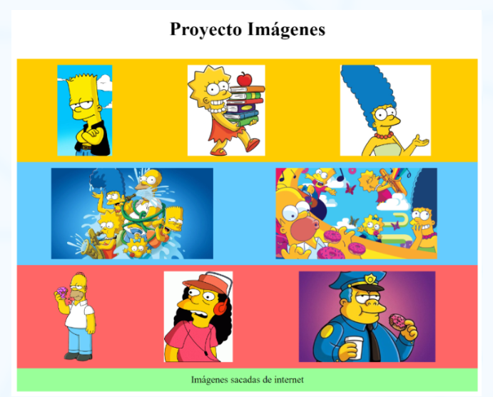
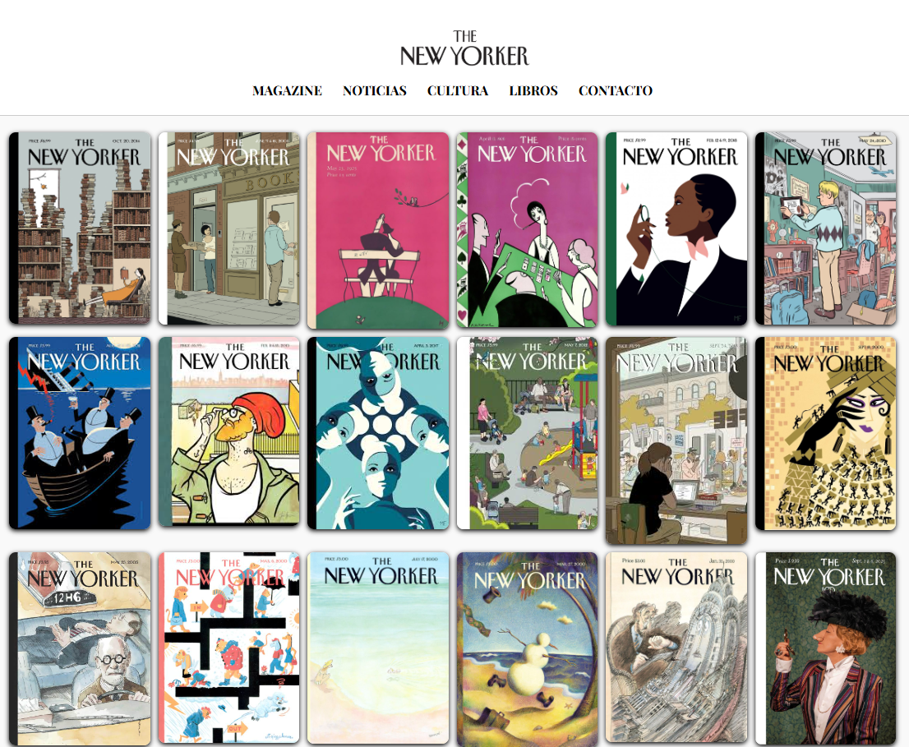

# The New Yorker 

_Un poco de padding, border y margin._

## Propiedad Display / Diseño con Imágenes (Core) 🚀

_Vamos a meternos en el emocionante mundo de GitHub y a practicar un poco de diseño web. Nuestro objetivo es crear algo genial usando algunas herramientas como padding, border y margin. Además, vamos a utilizar Flexbox, que es como la varita mágica del diseño web._

## Pre-requisitos 🛠️

- Para empezar, elige tus colores favoritos y las imágenes que más te gusten. Puedes usar Octodex en GitHub.
- Luego, vamos a recrear el diseño que ves aquí, asegurándonos de que todas las imágenes tengan el mismo tamaño y estén perfectamente alineadas.



## Realizado por mi 👌

_Agregue un navbar, donde incluí en CSS un:_
- Flexbox que me permitio alinear los elementos de forma más controlada.
- Centrar el logo y el menu.
- El padding para darle aire visual.
- Colocar una línea debajo del nav, para una separación visual.

**Código**  
<pre> 
  .ny-navbar {
    display: flex;
    flex-direction: column;
    align-items: center;
    padding: 20px 10px;
    border-bottom: 1px solid #ccc;
    background-color: #fff;
  }
  </pre>

### Para que sea responsivo se aplico los siguientes estilos:
- Si el ancho de la pantalla es igual o menor a 600px.
- Cambia el menú .ny-menu de horizontal a vertical.
- Agrega un espacio de 10px entre cada ítem del menú.
- Reduce el tamaño del logo (si es texto) para que no se vea gigante en pantallas pequeñas.

**Código**
```
@media (max-width: 600px) {
  .ny-menu {
    flex-direction: column;
    gap: 10px;
  }

  .ny-logo {
    font-size: 1.8rem;
  }
}
```
##  



️

_Una vez, The New Yorker publicó una portada con un perro usando gafas y leyendo la revista... ¡al revés! Era una sátira sobre los lectores que fingen entender todo. 🐶📖 Un guiño elegante al snobismo cultural, con humor fino._

---
⌨️ con ❤️ por [Katherine](https://github.com/mckateturry) 😊
